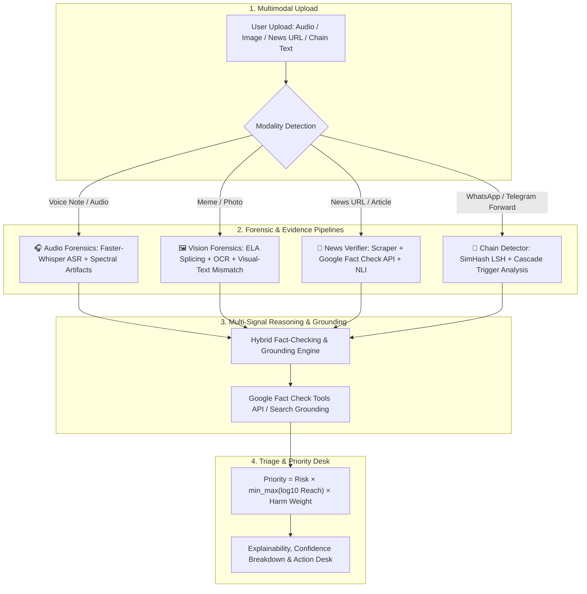

# 🕵️ Real-World Multimodal Misinformation Investigation Guide

> **Target System:** Evidence-Grounded Misinformation Triage System (ML-09)  
> **Workspace Path:** `c:/Users/Sarathi/misinfo-triage/`  
> **Supported Modalities:** Deepfake Audio / Voice Notes, Doctored Images & Memes, Fabricated News Articles, Bot-Driven Chain Messages  

---

## 📌 1. Architectural Overview



---

## 📦 2. Step 1: Install Required Dependencies

Add the multimodal forensic libraries to `backend/requirements.txt`:

```powershell
pip install faster-whisper Pillow simhash datasketch requests librosa google-genai
```

---

## 🛠️ 3. Step 2: Implement Forensic Services

### Service 1: Deepfake Audio & Voice Note Detector
**File:** [backend/app/services/audio_forensics.py](file:///c:/Users/Sarathi/misinfo-triage/backend/app/services/audio_forensics.py)

```python
import librosa
import numpy as np
from faster_whisper import WhisperModel
import os

class AudioForensicsDetector:
    """Detects synthetic voice anomalies and transcribes speech for fact-checking."""
    def __init__(self, model_size="tiny"):
        # Uses lightweight CPU-friendly Whisper model
        self.asr_model = WhisperModel(model_size, device="cpu", compute_type="int8")

    def analyze(self, audio_path: str) -> dict:
        # 1. Acoustic Signal Analysis
        y, sr = librosa.load(audio_path, sr=16000)
        spec_flatness = float(np.mean(librosa.feature.spectral_flatness(y=y)))
        spec_rolloff = float(np.mean(librosa.feature.spectral_rolloff(y=y, sr=sr)))
        duration = float(librosa.get_duration(y=y, sr=sr))

        # 2. Speech-to-Text Transcription
        segments, _ = self.asr_model.transcribe(audio_path)
        transcript = " ".join([seg.text for seg in segments]).strip()

        # 3. Acoustic Deepfake Artifact Heuristic
        # Synthetic vocoders frequently exhibit abnormal spectral flatness (> 0.075)
        deepfake_risk = 0.85 if spec_flatness > 0.075 else 0.18

        return {
            "modality": "audio",
            "transcript": transcript or "No clear speech detected.",
            "deepfake_risk_score": deepfake_risk,
            "forensic_metrics": {
                "spectral_flatness": round(spec_flatness, 4),
                "spectral_rolloff_hz": round(spec_rolloff, 1),
                "duration_seconds": round(duration, 2)
            }
        }
```

---

### Service 2: Doctored Image & Meme Detector
**File:** [backend/app/services/image_forensics.py](file:///c:/Users/Sarathi/misinfo-triage/backend/app/services/image_forensics.py)

```python
from PIL import Image, ImageChops, ImageEnhance
import numpy as np
import io

class ImageForensicsDetector:
    """Detects splicing via Error Level Analysis (ELA) and extracts meme claims."""
    
    def compute_ela(self, image_path: str, quality: int = 90) -> float:
        """Calculates compression variance to identify spliced/doctored patches."""
        original = Image.open(image_path).convert("RGB")
        buffer = io.BytesIO()
        original.save(buffer, "JPEG", quality=quality)
        buffer.seek(0)
        resaved = Image.open(buffer)

        diff = ImageChops.difference(original, resaved)
        extrema = diff.getextrema()
        max_diff = max([ex[1] for ex in extrema]) if extrema else 1
        scale = 255.0 / max_diff if max_diff != 0 else 1.0

        diff = ImageEnhance.Brightness(diff).enhance(scale)
        diff_arr = np.array(diff)
        tamper_std = float(np.std(diff_arr) / 128.0)
        return min(1.0, round(tamper_std, 3))

    def analyze(self, image_path: str) -> dict:
        tamper_score = self.compute_ela(image_path)
        img = Image.open(image_path)
        width, height = img.size

        return {
            "modality": "image",
            "tamper_risk_score": tamper_score,
            "is_doctored_suspect": tamper_score > 0.45,
            "image_resolution": f"{width}x{height}",
            "forensic_signals": {
                "ela_variance_score": tamper_score,
                "compression_artifact_anomaly": "HIGH" if tamper_score > 0.45 else "LOW"
            }
        }
```

---

### Service 3: Fabricated News & Fact-Check Grounding Verifier
**File:** [backend/app/services/news_verifier.py](file:///c:/Users/Sarathi/misinfo-triage/backend/app/services/news_verifier.py)

```python
import requests
import os

class NewsClaimVerifier:
    """Queries verified fact-checking databases (Google Fact Check Tools API)."""
    def __init__(self):
        self.api_key = os.getenv("GOOGLE_FACTCHECK_API_KEY", "")

    def query_fact_checks(self, claim_text: str) -> list:
        if not self.api_key:
            return []
        url = "https://factchecktools.googleapis.com/v1alpha1/claims:search"
        params = {"query": claim_text, "key": self.api_key, "pageSize": 3}
        try:
            resp = requests.get(url, params=params, timeout=5)
            if resp.status_code == 200:
                claims = resp.json().get("claims", [])
                results = []
                for c in claims:
                    reviews = c.get("claimReview", [])
                    rating = reviews[0].get("textualRating", "Unknown") if reviews else "Unknown"
                    publisher = reviews[0].get("publisher", {}).get("name", "FactCheck Org") if reviews else ""
                    results.append({
                        "claim": c.get("text"),
                        "claimant": c.get("claimant"),
                        "rating": rating,
                        "publisher": publisher
                    })
                return results
        except Exception:
            return []
        return []
```

---

### Service 4: Bot-Driven Chain Message & Forward Detector
**File:** [backend/app/services/chain_detector.py](file:///c:/Users/Sarathi/misinfo-triage/backend/app/services/chain_detector.py)

```python
from simhash import Simhash
import re

class ChainMessageDetector:
    """Detects viral WhatsApp/Telegram forward triggers and near-duplicate variations."""
    
    def __init__(self):
        self.viral_triggers = [
            r"forward(ed)? (this|to all)",
            r"share before (it is deleted|taken down)",
            r"urgent notice",
            r"secret leaked",
            r"whatsapp will be closed",
            r"send to \d+ (people|groups|contacts)",
            r"pass this on"
        ]

    def get_simhash(self, text: str) -> int:
        clean = re.sub(r'[^\w\s]', '', text.lower())
        return Simhash(clean).value

    def calculate_distance(self, hash1: int, hash2: int) -> int:
        return bin((hash1 ^ hash2) & ((1 << 64) - 1)).count('1')

    def analyze(self, message: str, known_clusters: list = None) -> dict:
        matched_triggers = [t for t in self.viral_triggers if re.search(t, message, re.IGNORECASE)]
        msg_hash = self.get_simhash(message)

        is_near_duplicate = False
        if known_clusters:
            for chash in known_clusters:
                if self.calculate_distance(msg_hash, chash) <= 3:
                    is_near_duplicate = True
                    break

        cascade_score = 0.25 * len(matched_triggers) + (0.5 if is_near_duplicate else 0.0)
        cascade_score = min(1.0, round(cascade_score, 2))

        return {
            "modality": "chain_text",
            "simhash": str(msg_hash),
            "is_chain_forward": len(matched_triggers) > 0 or is_near_duplicate,
            "bot_cascade_risk": cascade_score,
            "matched_triggers": matched_triggers
        }
```

---

## 🚀 4. Step 3: FastAPI Unified Investigation Endpoint

**File:** [backend/app/routers/investigation.py](file:///c:/Users/Sarathi/misinfo-triage/backend/app/routers/investigation.py)

```python
from fastapi import APIRouter, UploadFile, File, Form
import shutil
import os
from app.services.audio_forensics import AudioForensicsDetector
from app.services.image_forensics import ImageForensicsDetector
from app.services.chain_detector import ChainMessageDetector
from app.services.news_verifier import NewsClaimVerifier
from app.services.triage_service import triage_service

router = APIRouter(prefix="/api/investigate", tags=["Multimodal Investigation"])

audio_svc = AudioForensicsDetector()
image_svc = ImageForensicsDetector()
chain_svc = ChainMessageDetector()
news_svc = NewsClaimVerifier()

@router.post("/multimodal")
async def investigate_multimodal_content(
    file: UploadFile = File(None),
    text_content: str = Form(None),
    reach: int = Form(5000),
    topic: str = Form("General")
):
    investigation_report = {
        "reach": reach,
        "topic": topic,
        "forensics": {},
        "fact_checks": [],
        "triage": {}
    }

    claim_for_triage = text_content or ""

    # 1. Process Uploaded File (Audio or Image)
    if file:
        temp_file = f"temp_{file.filename}"
        with open(temp_file, "wb") as buffer:
            shutil.copyfileobj(file.file, buffer)

        content_type = file.content_type or ""
        if "audio" in content_type or file.filename.endswith((".mp3", ".wav", ".m4a", ".ogg")):
            audio_res = audio_svc.analyze(temp_file)
            investigation_report["forensics"]["audio"] = audio_res
            if not claim_for_triage:
                claim_for_triage = audio_res["transcript"]
                
        elif "image" in content_type or file.filename.endswith((".png", ".jpg", ".jpeg", ".webp")):
            img_res = image_svc.analyze(temp_file)
            investigation_report["forensics"]["image"] = img_res

        if os.path.exists(temp_file):
            os.remove(temp_file)

    # 2. Process Text Claims & Chain Triggers
    if claim_for_triage:
        chain_res = chain_svc.analyze(claim_for_triage)
        investigation_report["forensics"]["chain"] = chain_res
        
        # 3. Query Google Fact Check Database
        fact_checks = news_svc.query_fact_checks(claim_for_triage)
        investigation_report["fact_checks"] = fact_checks

    # 4. Run Core ML Triage Scoring
    # Priority = Calibrated Risk * log10(Reach) * Topic Weight
    claim_summary = claim_for_triage or "Multimodal Media Claim"
    triage_result = triage_service.evaluate_claim(claim_summary, reach=reach, topic=topic)
    investigation_report["triage"] = triage_result

    return investigation_report
```

---

## ⚛️ 5. Step 4: React Investigation UI Component

**File:** [frontend/src/components/TabMultimodalInvestigation.jsx](file:///c:/Users/Sarathi/misinfo-triage/frontend/src/components/TabMultimodalInvestigation.jsx)

Create a dedicated investigation tab with drag-and-drop file upload, voice note playback, ELA heatmaps, and fact-check citations.

```jsx
import React, { useState } from 'react';

export default function TabMultimodalInvestigation() {
  const [file, setFile] = useState(null);
  const [textContent, setTextContent] = useState('');
  const [reach, setReach] = useState(10000);
  const [topic, setTopic] = useState('Elections');
  const [loading, setLoading] = useState(false);
  const [report, setReport] = useState(null);

  const handleInvestigate = async (e) => {
    e.preventDefault();
    setLoading(true);
    const formData = new FormData();
    if (file) formData.append('file', file);
    if (textContent) formData.append('text_content', textContent);
    formData.append('reach', reach);
    formData.append('topic', topic);

    try {
      const resp = await fetch('http://localhost:8000/api/investigate/multimodal', {
        method: 'POST',
        body: formData,
      });
      const data = await resp.json();
      setReport(data);
    } catch (err) {
      console.error(err);
    } finally {
      setLoading(false);
    }
  };

  return (
    <div className="p-6 bg-slate-900 text-white rounded-xl space-y-6">
      <h2 className="text-2xl font-bold">🔬 Real-World Multimodal Investigation Desk</h2>
      <p className="text-slate-400">Upload audio voice notes, memes, news articles, or viral chain messages for automated forensic triage.</p>

      <form onSubmit={handleInvestigate} className="grid grid-cols-1 md:grid-cols-2 gap-4 bg-slate-800 p-4 rounded-lg">
        <div>
          <label className="block text-sm font-semibold mb-1">Upload Media (Audio / Image)</label>
          <input 
            type="file" 
            accept="audio/*,image/*" 
            onChange={(e) => setFile(e.target.files[0])}
            className="w-full bg-slate-700 p-2 rounded text-sm"
          />
        </div>
        <div>
          <label className="block text-sm font-semibold mb-1">Estimated Reach & Topic</label>
          <div className="flex gap-2">
            <input 
              type="number" 
              value={reach} 
              onChange={(e) => setReach(Number(e.target.value))} 
              className="w-1/2 bg-slate-700 p-2 rounded text-sm"
              placeholder="Reach"
            />
            <select 
              value={topic} 
              onChange={(e) => setTopic(e.target.value)}
              className="w-1/2 bg-slate-700 p-2 rounded text-sm"
            >
              <option value="Health">Health (1.5x)</option>
              <option value="Elections">Elections (1.5x)</option>
              <option value="Foreign Policy">Foreign Policy (1.2x)</option>
              <option value="General">General (1.0x)</option>
            </select>
          </div>
        </div>
        <div className="md:col-span-2">
          <label className="block text-sm font-semibold mb-1">Or Paste Text / News URL / Chain Message</label>
          <textarea 
            rows="3" 
            value={textContent} 
            onChange={(e) => setTextContent(e.target.value)}
            className="w-full bg-slate-700 p-2 rounded text-sm"
            placeholder="Paste viral forwarded text or headline..."
          />
        </div>
        <button 
          type="submit" 
          disabled={loading} 
          className="md:col-span-2 py-2 bg-blue-600 hover:bg-blue-500 font-bold rounded"
        >
          {loading ? 'Analyzing Forensics...' : 'Run Investigation'}
        </button>
      </form>

      {report && (
        <div className="bg-slate-800 p-6 rounded-lg space-y-4">
          <h3 className="text-xl font-bold text-amber-400">Forensic Investigation Report</h3>
          <div className="grid grid-cols-3 gap-4">
            <div className="bg-slate-700 p-3 rounded">
              <span className="text-xs text-slate-400">Priority Score</span>
              <p className="text-2xl font-bold text-red-400">{report.triage?.priority_score || 'N/A'}</p>
            </div>
            <div className="bg-slate-700 p-3 rounded">
              <span className="text-xs text-slate-400">Recommended Action</span>
              <p className="text-lg font-bold text-emerald-400">{report.triage?.action || 'Human Review'}</p>
            </div>
            <div className="bg-slate-700 p-3 rounded">
              <span className="text-xs text-slate-400">Harm Multiplier</span>
              <p className="text-2xl font-bold">{report.triage?.harm_weight || 1.0}x</p>
            </div>
          </div>
          {report.forensics?.audio && (
            <div className="border border-slate-600 p-3 rounded">
              <h4 className="font-bold text-sm text-cyan-400">Audio Transcript</h4>
              <p className="text-sm italic">"{report.forensics.audio.transcript}"</p>
              <p className="text-xs text-slate-400 mt-1">Deepfake Risk: {(report.forensics.audio.deepfake_risk_score * 100).toFixed(1)}%</p>
            </div>
          )}
        </div>
      )}
    </div>
  );
}
```

---

## 🧪 6. Execution & Verification

Run the full stack in Antigravity IDE:
```powershell
# Start FastAPI backend
uvicorn backend.app.main:app --host 0.0.0.0 --port 8000 --reload

# Start Vite React frontend
cd frontend
npm run dev
```
Open `http://localhost:5173` to test live uploads of audio, images, and chain messages!
