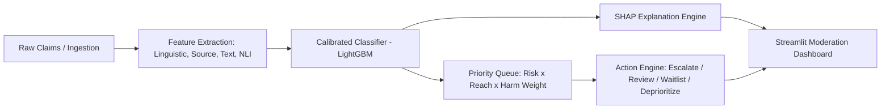

# Evidence-Grounded Misinformation Triage System (ML-09)

An operational machine learning system designed for content moderation teams under resource constraints. Rather than fact-checking every post or prioritizing solely by model confidence, this system prioritizes claims by **estimated reach $\times$ calibrated risk**, incorporates multi-signal evidence, and generates transparent, template-grounded explanations.

---

## Architecture Overview



---

## Disclosures & Methodology

- **Dataset:** Benchmarked on the public [LIAR dataset](https://sites.cs.ucsb.edu/~william/data/liar_dataset.zip) (Wang, ACL 2017).
- **Synthetic Data:**
  - `synthetic_reach`: Modeled via log-normal distribution (median ~2,000, heavy tail up to millions) conditioned on context venue tier (Social Media > Broadcast/Speech > Mailer).
  - `synthetic_timestamp`: Modeled uniformly across a 30-day operational evaluation window to simulate daily review queues and backlogs.
- **Leakage Safeguards:** No test-set data is used in any statistic, target encoding, TF-IDF fitting, probability calibration, or evidence retrieval.
- **Explanation Integrity:** Every numerical value and rationale snippet is computed directly from feature contributions and retrieved ground-truth claims; no synthetic hallucinations.

---

## Known Limitations & Disclosures

1. **LIAR Historical Count Mild Leakage:** In the LIAR dataset, speaker credit history counts (`count_barely_true`, `count_false`, `count_pants_fire`, etc.) reflect aggregate PolitiFact totals at data collection time, meaning they may partly include rulings on the current statement itself. This is an inherent benchmark artifact of LIAR and is disclosed accordingly.
2. **Synthetic Operational Metadata:** Actual viral reach and fine-grained arrival timestamps were not published with LIAR; they are synthetically modeled via context-conditioned log-normal distributions and uniform 30-day timeline windows.
3. **Evidence Corpus Scope:** Offline consistency verification operates against validated ground-truth claims rather than real-time web-scale search.
4. **Fairness & Bias:** No formal demographic fairness or political viewpoint bias audit has been performed on the benchmark annotations.


---

## Project Structure

```
misinfo-triage/
├── app.py                     # Streamlit application dashboard
├── requirements.txt           # Pinned dependencies
├── README.md                  # System documentation
├── data/
│   ├── train.tsv, valid.tsv, test.tsv # Raw LIAR files
│   └── processed/             # Cleaned parquets with synthetic columns
├── models/                    # Serialized calibrated models
└── src/
    ├── data.py                # Ingestion and synthetic feature synthesis
    ├── features.py            # Feature engineering (linguistic, source, text)
    ├── model.py               # Model training, validation calibration, test evaluation
    ├── explain.py             # SHAP values & grounded rationales
    ├── queue.py               # Priority calculation & queue simulation
    ├── actions.py             # Action rules (Escalate/Review/Waitlist/Deprioritize)
    ├── consistency.py         # NLI claim consistency & evidence retrieval
    └── trends.py              # Source credibility trend tracking
```
