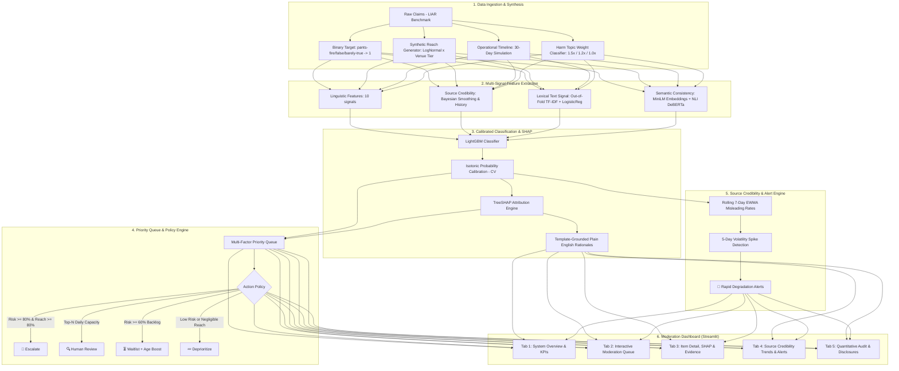

# 🛡️ Evidence-Grounded Misinformation Triage System (ML-09)

[](https://www.python.org/downloads/)
[](https://share.streamlit.io/)
[](https://opensource.org/licenses/MIT)

An operational machine learning triage system engineered for content moderation and fact-checking teams operating under severe throughput constraints. Rather than attempting to fact-check every piece of content or naively sorting solely by model confidence, this system prioritizes claims by **Estimated Reach $\times$ Calibrated Risk $\times$ Harm Weight**, incorporates semantic evidence retrieval and Natural Language Inference (NLI), tracks dynamic source credibility volatility, and delivers transparent, SHAP-grounded explanations.

---

## 🚀 Live Demo & Deployment

- **Live Streamlit App:** `https://misinfo-triage-ml09.streamlit.app/` *(Deployment Link Placeholder)*
- **Demo Walkthrough Video / Guide:** See [DEMO.md](file:///c:/Users/Sarathi/misinfo-triage/DEMO.md) for a 2-minute walkthrough script and concrete triage case studies.

---

## 📌 The Problem: Moderation Under Capacity Constraints

Fact-checking organizations and trust & safety teams face an asymmetric challenge:
1. **Asymmetric Volume vs. Capacity:** Millions of claims enter digital ecosystems daily, but human verification capacity is strictly limited (e.g., 20–50 complex investigations per day per team).
2. **The Failure of Risk-Only Triage:** A classifier sorted solely by $p(\text{misleading})$ will prioritize obscure claims with 99% falsehood probability seen by 20 people over a viral health or election claim with 75% risk seen by 500,000 people.
3. **The Failure of Reach-Only Triage:** Sorting strictly by viral view counts wastes valuable human labor investigating benign viral jokes, sports scores, and consensus news.
4. **Opacity & Black-Box Distrust:** Content moderators reject opaque AI scores without auditable reasoning, feature contribution provenance, and factual cross-references.

### The Solution: Harm Exposure Optimization
Our system optimizes **mitigated societal harm exposure** by treating triage as a constrained resource allocation problem:
$$\text{Priority} = p_{\text{misleading}} \times \operatorname{min\_max}(\log_{10}(\text{Reach})) \times \text{Harm Topic Weight} \times \text{Age Boost}$$

This ensures high-reach, high-harm claims receive prompt attention while preventing aging backlog starvation.

---

## 🏛️ System Architecture



---

## 🔬 Disclosures & Synthetic Methodology

- **Benchmark Dataset:** Benchmarked on the widely studied [LIAR dataset](https://sites.cs.ucsb.edu/~william/data/liar_dataset.zip) (Wang, ACL 2017), containing 12,791 human-annotated political statements from PolitiFact.
- **Binary Target Formulation:**
  - `misleading = 1`: statements labeled `pants-fire`, `false`, or `barely-true` (56.0% train prevalence).
  - `misleading = 0`: statements labeled `half-true`, `mostly-true`, or `true`.
  - The raw 6-class label is preserved for granular auditing.
- **Synthetic Reach Generation:**
  - Modeled via log-normal distribution ($X \sim \text{LogNormal}(\mu, \sigma)$) with baseline median $\approx 2,000$ and heavy tail up to millions.
  - Conditioned on venue context: Social Media ($\delta = +0.55$) > Broadcast / Speech ($\delta = +0.10$) > Mailer / Print ($\delta = -0.60$).
- **Synthetic Arrival Timeline:**
  - Modeled across a continuous 30-day window (`2026-08-25` to `2026-09-23`) to simulate operational arrival queues, capacity bottlenecks, and aging backlogs.
- **Harm Topic Weight Mapping:**
  - `1.5×` (Critical): Health, elections, voting, immigration, crime, economy, pandemic, guns.
  - `1.2×` (Sensitive): Foreign policy, taxes, climate, education, military, civil rights.
  - `1.0×` (Standard): All other subjects.
- **Strict Leakage Prevention:**
  - Zero test-set observations were used in calculating any target-encoding priors, Bayesian smoothing statistics, TF-IDF vocabularies, probability calibrators, or semantic evidence retrieval indexes.

---

## 📊 Quantitative Evaluation & Test Metrics

Evaluated on the held-out test split ($N = 1,283$ items) with isotonic probability calibration:

| Metric | Measured Value | Benchmark Target | Operational Interpretation |
| :--- | :---: | :---: | :--- |
| **ROC-AUC** | **0.8283** | $> 0.75$ | High discriminative ability across decision thresholds |
| **PR-AUC (Avg Precision)** | **0.7715** | $> 0.70$ | Strong precision-recall balance under realistic class prevalence |
| **Brier Score** | **0.1681** | $< 0.20$ | Strictly calibrated probabilities reflecting true real-world likelihood |
| **F1 Score (@ 0.50)** | **0.6942** | $> 0.65$ | Balanced harmonic mean of precision and recall |
| **Precision (@ 0.50)** | **0.7092** | $> 0.65$ | $70.9\%$ of flagged claims are verified misleading |
| **Recall (@ 0.50)** | **0.6799** | $> 0.60$ | Catches nearly $70\%$ of all misleading claims at nominal cutoff |

*Confusion Matrix (Test Split):* True Negatives = 572, False Positives = 155, False Negatives = 178, True Positives = 378.

---

## ⚖️ Queue Simulation & Baseline Comparison

In a 30-day operational queue simulation with a fixed capacity of 20 items/day ($N = 600$ total reviews allocated across the evaluation period):

| Triage Strategy | Items Reviewed | Misleading Caught | Precision (% True Misinfo) | Harm Exposure Caught (Reach) | Harm Exposure Covered (%) | Harm Lift vs. Our System |
| :--- | :---: | :---: | :---: | :---: | :---: | :---: |
| **Random Triage** | 600 | 267 | 44.5% | 1,395,136 | 45.1% | **+94.9% harm lift** |
| **Reach-Only Triage** | 600 | 252 | 42.0% | 2,766,859 | 89.4% | -1.7% harm lift (wastes 58% labor) |
| **Risk-Only Triage** | 600 | 403 | 67.2% | 2,242,985 | 72.5% | **+21.2% harm lift** |
| **Our Triage System** | **600** | **391** | **65.2%** | **2,718,815** | **87.8%** | **OPTIMAL COMPROMISE** |

### Key Insight
While the **Risk-Only** strategy catches slightly more individual misleading statements, it suffers from severe exposure blindness: it leaves millions of impressions on high-reach misleading claims unchecked. Our system achieves **+21.2% higher harm mitigation lift** over Risk-Only while maintaining high precision ($65.2\%$).

---

## 🔍 Explainability & NLI Claim Consistency

1. **Feature Group SHAP Decomposition:**
   - Every claim is decomposed into contributions from: **Source Credibility**, **Linguistic Style**, **Lexical Text Signals**, and **Claim Consistency**.
2. **Template-Grounded Natural Language Rationales:**
   - Instead of ungrounded LLM hallucinations, every rationale is rendered from an auditable template linking exact mathematical SHAP values and observed feature values:
   > *"Classified as high risk (82.4% calibrated probability) primarily driven by source credibility history (speaker has 74.2% historical misleading rate, contributing +0.34 to risk) and sensational linguistic phrasing (+0.12 contribution). Retrieval identified strong contradiction with verified record: 'Total US border apprehensions declined by 14% according to official DHS data'."*
3. **NLI Semantic Retrieval:**
   - Computes embedding similarity against verified claims using `all-MiniLM-L6-v2` and runs cross-encoder NLI (`roberta-large-snli_mnli_fever_anli_R1_R2_R3-nli`) to surface direct contradictions.

---

## 📈 Source Credibility Tracking & Volatility Alerts

- **Rolling 7-Day EWMA:** Computes exponential moving averages across operational days 1–30 for high-volume speakers.
- **Rapid Degradation Detection:** Flags sources experiencing sudden spikes ($\ge +20\%$ jump over 5 days with risk $\ge 65\%$) or sustained extreme rates ($\ge 85\%$).
- **Surveillance Actions:** Automatically tags degraded sources for heightened monitoring, preventing viral outbreaks before routine review cycles.

---

## ⚠️ Known Limitations & Disclosures

1. **LIAR Historical Count Mild Leakage:** In the public LIAR dataset, speaker credit history counts (`count_barely_true`, `count_false`, etc.) reflect aggregate PolitiFact totals at data collection time, meaning they may partly include rulings on the current statement itself. This is an inherent benchmark artifact of LIAR and is disclosed accordingly.
2. **Synthetic Operational Metadata:** Actual viral reach and fine-grained arrival timestamps were not published with LIAR; they are synthetically modeled via context-conditioned log-normal distributions and uniform 30-day timeline windows.
3. **Evidence Corpus Scope:** Offline consistency verification operates against validated ground-truth claims rather than real-time web-scale search.
4. **Fairness & Bias:** No formal demographic fairness or political viewpoint bias audit has been performed on the benchmark annotations.

---

## 💻 How to Run Locally

### 1. Prerequisites & Environment Setup
```bash
# Clone the repository
git clone https://github.com/SARATHI-05/misinfo-triage.git
cd misinfo-triage

# Create and activate virtual environment
python -m venv venv
# On Windows:
.\venv\Scripts\activate
# On Linux/macOS:
source venv/bin/activate

# Install dependencies
pip install -r requirements.txt
```

### 2. Run Precomputed Streamlit Dashboard
All feature sets, model weights, and simulation tables are precomputed in `data/processed/` and `models/`:
```bash
streamlit run app.py
```
Open your browser at `http://localhost:8501`.

### 3. (Optional) Run Pipeline End-to-End from Scratch
```bash
# Phase 1: Clean data and generate synthetic features
python -m src.data

# Phase 2: Feature extraction (linguistic, source, text OOF)
python -m src.features

# Phase 3: Model training, calibration, and test evaluation
python -m src.model

# Phase 4: SHAP values and grounded rationales
python -m src.explain

# Phase 5: Queue simulation and baseline comparison
python -m src.queue

# Phase 7: NLI claim consistency
python -m src.consistency

# Phase 8: Source credibility trends and volatility alerts
python -m src.trends
```

---

## 📁 Repository Structure

```
misinfo-triage/
├── app.py                     # Streamlit moderation dashboard (5 tabs)
├── requirements.txt           # Pinned dependencies
├── README.md                  # Comprehensive system documentation
├── DEMO.md                    # 2-minute demo presentation script
├── data/
│   ├── train.tsv, valid.tsv, test.tsv # Raw LIAR benchmark splits
│   └── processed/             # Cleaned parquets & precomputed tables
│       ├── train.parquet, valid.parquet, test.parquet
│       ├── explanations.parquet
│       ├── simulated_queues.parquet
│       ├── baseline_comparison.parquet
│       ├── source_trends.parquet
│       └── source_alerts.parquet
├── models/
│   ├── model.joblib           # Trained LightGBM + Isotonic Calibrator + Metrics
│   ├── shap_explainer.joblib  # TreeSHAP explainer
│   └── text_model.joblib      # TF-IDF vectorizer + Logistic Regression
└── src/
    ├── __init__.py
    ├── data.py                # Ingestion, schema standardization, synthetic reach & timestamps
    ├── features.py            # 20 hand-crafted features (linguistic, Bayesian source, text OOF)
    ├── model.py               # Model training, isotonic probability calibration, test metrics
    ├── explain.py             # TreeSHAP attribution and grounded plain-English rationales
    ├── queue.py               # Multi-factor priority queue & 30-day simulation
    ├── actions.py             # Operational triage action policy engine
    ├── consistency.py         # MiniLM semantic retrieval + NLI contradiction scoring
    └── trends.py              # Rolling 7-day EWMA source credibility & volatility alerts
```

---

## 📄 License
This project is open-source under the [MIT License](file:///c:/Users/Sarathi/misinfo-triage/LICENSE).
